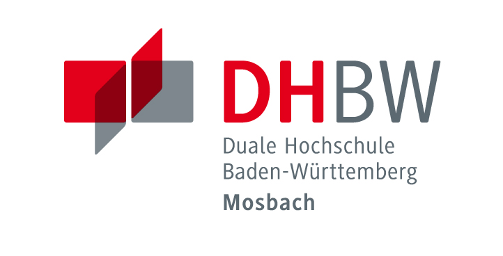

# Studienarbeit_Online
# Studienarbeit 

## Entwicklung eines Systems zur automatisierten Aufnahme von   Bilder für KI (CNN) mit Unterstützung des Roboters Cobotta 
 
# Betreuer: 
    - Stefan Bauer
    - Sven Benseler 
    
 # Website für die Steuerung/ Überwachung des Systemes
